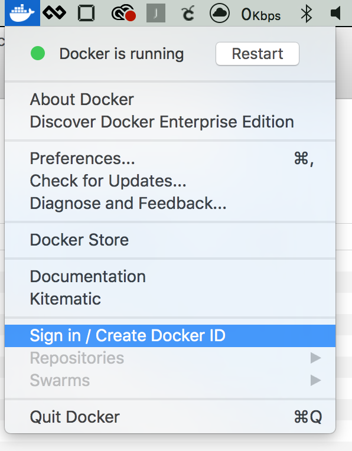
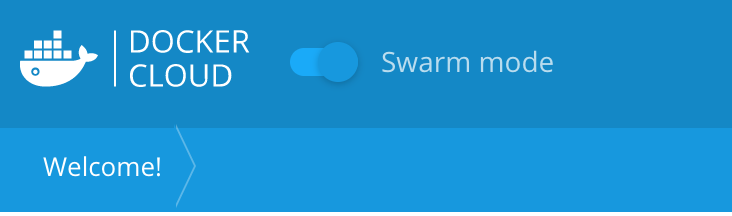

# DX Docker Con Demo

## Demo setup

Make sure these things are done before you run this demo for the very first time. 

1. 	Have Docker For Mac (Edge) or Docker for Windows (Edge) installed

2. Make sure your D4X machine is running in Swarm mode, inside a command window type

		$ docker swarm init
		
		Swarm initialized: current node (0iu7hrsm1uygvegb5teroquhg) is now a manager. 
		<output truncated>

2. From D4M or D4W make sure you're  logged into Docker Cloud

		Username: dcdemo
		Password: D0ck#r123!

	
	
3. Clone `https://github.com/mikegcoleman/dcus-booth-demo-2017.git` onto the demo machine

		$ git clone https://github.com/mikegcoleman/dcus-booth-demo-2017.git 
             
5. Navigate in a web browser to [https://cloud.docker.com](https://cloud.docker.com) and log in w/ the credentials in step 3. 

> **Note** If your top menu does not look like the image below, click the ```Swarm Mode``` slider at the top of the left hand menu



## Running the Demo
This demo is designed to show how you can use Docker for Mac or Docker for Windows alongside Docker Cloud in your everyday development workflow to not only  manage Docker containers locally, but also across Docker Swarms running on virtually any platform.

For this demo I have Docker for Mac (or Docker for Windows) installed, and I've got an application, Docker Pets, that I've just built. I'm going to deploy it locally, then I'm going to deploy to Swarm Clusters running on AWS, Azure, and/or GCP. 

So let's jump in and start by deploying our simple web app locally. 

1. Change into the `dxdemo` directory (this is assuming you cloned the repo into the user home directory)

		$ cd ~/dcus-booth-demo-2017/dxdemo

2. Examine the contents of the `docker-compose.yml` file 

		$ cat docker-compose.yml
		
	Explain the various lines in the compose file. 
	
3. Deploy the Docker stack locally, ensure the stack is running, as well as the services

		$ docker stack deploy -c docker-compose.yml pets
		Creating network pets_default
		Creating service pets_web
		
		$ docker stack ls		
		NAME  SERVICES
		pets  1
		
		$ docker service ls
		ID                  NAME                MODE                REPLICAS            IMAGE
		t2acr7niw82w        pets_web            replicated          1/1                 dcdemo/docker-pets:latest

4. Navigate in your browser to `https://localhost:5000` to show the service running. 

Now that we know the service is running as expected locally, let's deploy it to the cloud. Docker for Mac/Windows allows us to manage federated Docker Swarms. Today there is deep integration with AWS (with integration for both Azure and GCP coming shortly). But if you're not running on AWS (or even in the cloud) you can still "bring your own swarm". 

Let's take a look at that integration. 

1. Right click on the Docker Logon on the taskbar (top for Mac or bottom right for Windows). Hover over the repositories and swarms menu item and point out that because we're integrated with Docker Cloud we can see all our repos as well as our running swarms. 

2. From that menu click on `Swarms | Create...` 

3. This takes us to Docker Cloud where we can deploy a new Swarm. I've previously linked my AWS account here, and we'll go through the steps of deploying a new Swarm, but not actually do it for the sake of time. 

4. Enter `test-swarm` for the name

5. Click on the AWS button 

6. Select a region from the drop down (any region is fine since we aren't actually deploying)

7. Scroll through the options and highlight how you can select the number of manager nodes and worker nodes, as well as the size of those nodes, as well as other settings. 

8. Click `Cancel`

So, let's pretend we've gone ahead and created a new Swarm. Let's use Docker for Mac/Windows to interact with it. 

1. Right click on the Docker icon in the taskbar and select `Swarms| aws-test`

	This will bring up a terminal window, and the Docker Client will be pointing out our Swarm up in AWS. 

2. Display the nodes in the Swarm

		$ docker node ls
		ID                           HOSTNAME                       STATUS  AVAILABILITY  MANAGER STATUS
		bk95dyryqfqpbdjxicdkcccq7 *  ip-172-31-14-107.ec2.internal  Ready   Active        Leader
		jy8wmqh82dcvetffvc5alp4os    ip-172-31-28-200.ec2.internal  Ready   Active        
		yu8l6rq0b92dsf6bmlifv64re    ip-172-31-38-36.ec2.internal   Ready   Active
		
	> **Note** You're not actually attached to a node in the Swarm cluster your are simply pointing your local machine at the cluster running in AWS
	
3. Change into the `dxdemo` directory (this assumes you cloned the repo into user home directory)

		$ cd ~/dcus-booth-demo-2017/dxdemo
		
4. Deploy the application into AWS

		$ docker stack deploy -c docker-compose.yml pets
		Creating network pets_default
		Creating service pets_web
		
	> **Note** Notice we didn't change anything from the way we deployed locally. We also didn't have to mess with anything in AWS such as firewall rules or load balancers. When Docker Cloud builds your cluster in AWS it takes care of those details. For instance, firewall ports are opened on demand as applications are started up. 

5. Verify the application is running by navigating in  your broswer to `http://aws-test.dockerdemos.com:5000`

So, we showed quickly how we can build clusters in AWS using Docker for Mac/Windows and we then deployed application from our local environment into the cloud. 

You can also manage already-existing Docker Swarms. 

1. In your browser navigate to `https://cloud.docker.com` and click `Swarms` on the top menu. 

	Notice these are the same swarms that showed up in my Docker for Mac/Windows menu. 
	
2. Click on `Bring your own Swarm`

	Running this command on a Swarm manager, will bring it into my collection of Swarms. This is exactly what we did w/ the Azure swarm we have in our group. One thing to note is that when you do this you don't get the benefits of the automatic firewall rules and load balancers I mentioned previously. 
	
3. Click `Close Window`

Let's attach to our Azure-based swarm and deploy our application again

1. Right click on the Docker icon in the taskbar and select `Swarms| azure-test`

	This will bring up a terminal window, and the Docker Client will be pointing out our Swarm up in AWS. 

2. Display the nodes in the Swarm

		$ docker node ls
		ID                           HOSTNAME      STATUS  AVAILABILITY  MANAGER STATUS
		1scluo2kwq5s3rcku0vpcib5j    mike-booth-2  Ready   Active        
		83x4rl5i7uibdvsqscyy1ygod *  mike-booth-1  Ready   Active        Leader
		str061ca3ymfajvh7obqm0awc    mike-booth-3  Ready   Active  
		
3. Change into the `dxdemo` directory (this assumes you cloned the repo into the current user home directory)

		$ cd ~/dcus-booth-demo-2017/dxdemo
		
4. Deploy the application into Azure

		$ docker stack deploy -c docker-compose.yml pets
		Creating network pets_default
		Creating service pets_web
		
5. Verify the application is running by navigating in  your broswer to `http://azure-test.dockerdemos.com:5000`

In this demo we looked at how Docker for Mac/Windows along with Docker Cloud allows you to manage both local and remote Docker Swarm instances to allow you greater flexiblity in the way you develop and test applications. 

## Demo cleanup
1. Remove the pets app from your local environment, aws, and azure. In each terminal window run:

		$ docker stack rm pets
		
2. Close the terminal windows for AWS and Azure (otherwise you'll end up with dozens of Windows open)


